# HSE Induction — Scene Preview Gallery (v2 — latest)

> Latest stills. If images look cached, open each file directly in `preview/v2/`.
> Full animated video (rendered after approval): [`../out/hse-induction.mp4`](../out/hse-induction.mp4).

| # | Scene (script beat) | Preview |
|---|---|---|
| 1 | Welcome — GLOBAL logo + QHSE Induction (officer waving; message in clean card, clear of him) | 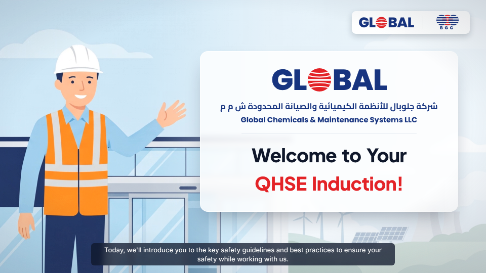 |
| 2 | About GCMS — **history as an animated timeline**: 1963 → 1976 → **BGC (Al Barami Group)** | 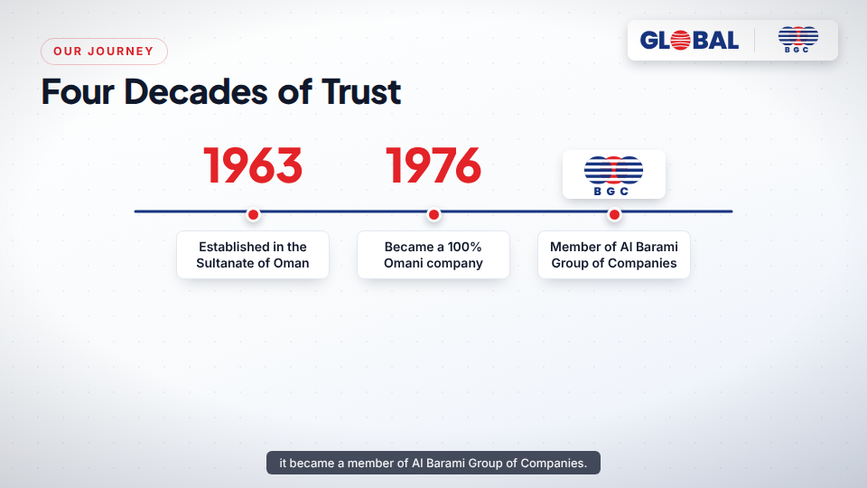 |
| 2b | About GCMS — full project lifecycle (control room) | 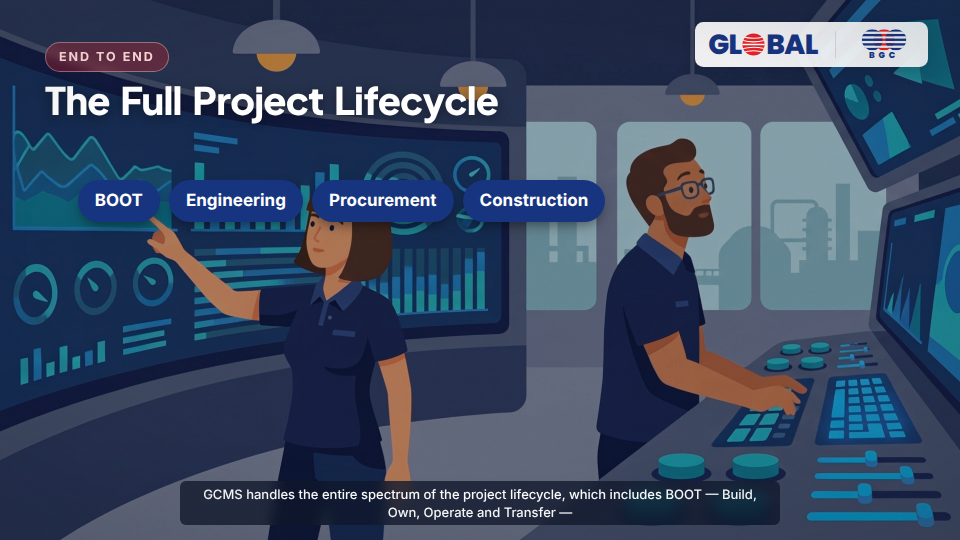 |
| 3 | Approvals & Certifications (DCRP · JSRS · OPAL · ISO · Tender Board) | 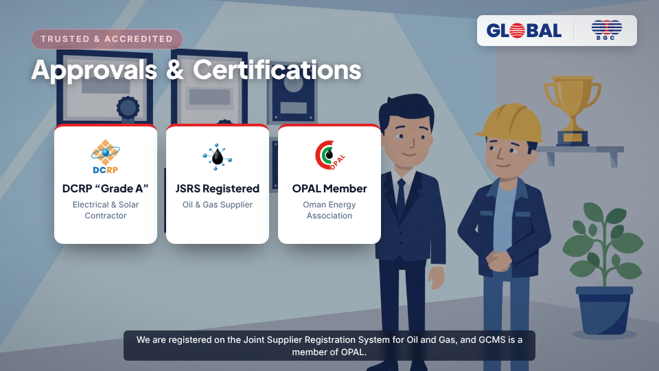 |
| 4 | Safety Is Your Priority — labels **below** each person (adult vendor) | 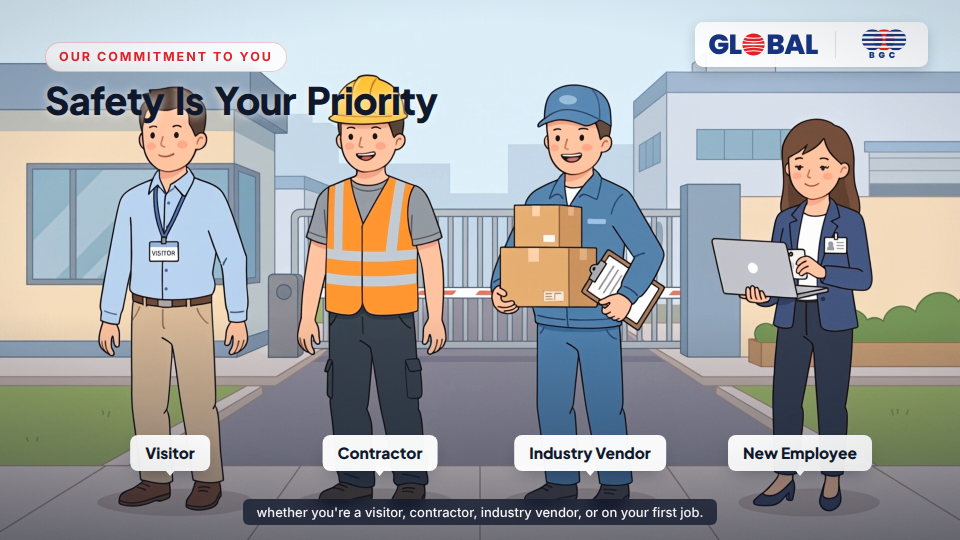 |
| 5 | First Things First — labels below host / pass / no-photos | 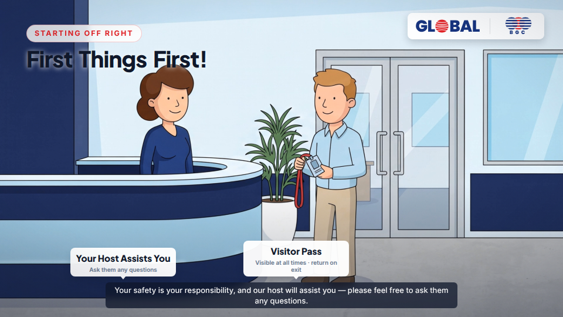 |
| 6 | Wear Your PPE — gearing up in the locker room | 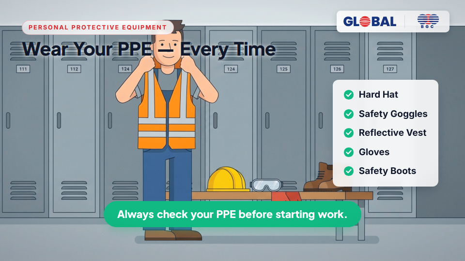 |
| 7a | Emergency Procedures — corridor evacuation, labels below equipment | 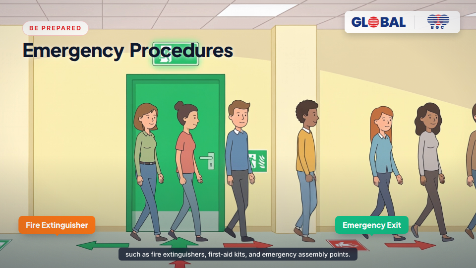 |
| 7b | Assembly Point — headcount | 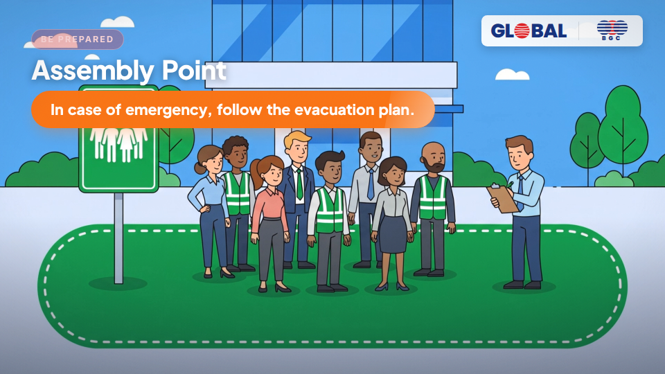 |
| 8 | Hazard Identification — labels below each hazard | 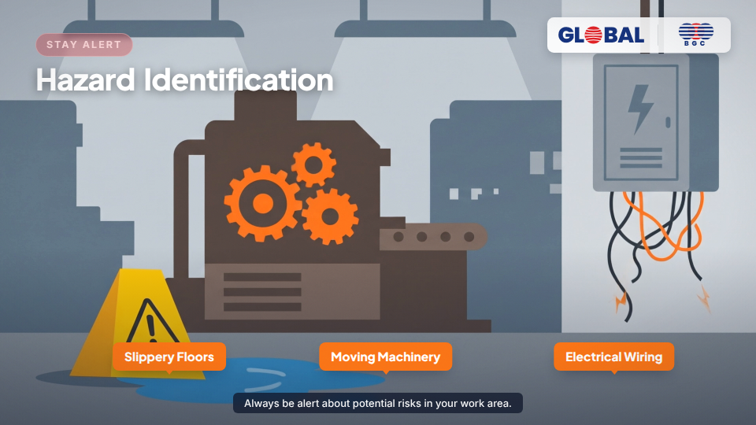 |
| 9 | Safe Work Practices — correct vs incorrect lifting | 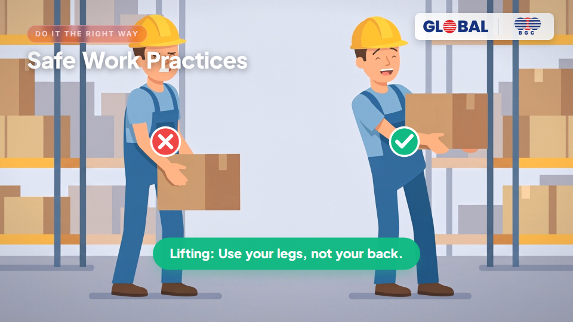 |
| 10 | The 12 Golden Life Saving Rules | 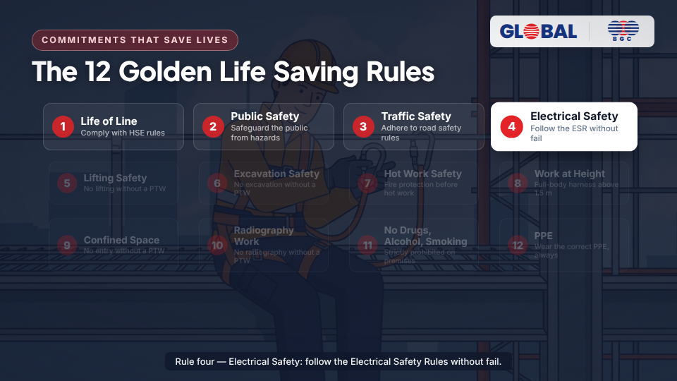 |
| 11 | Report Incidents & Near Misses | 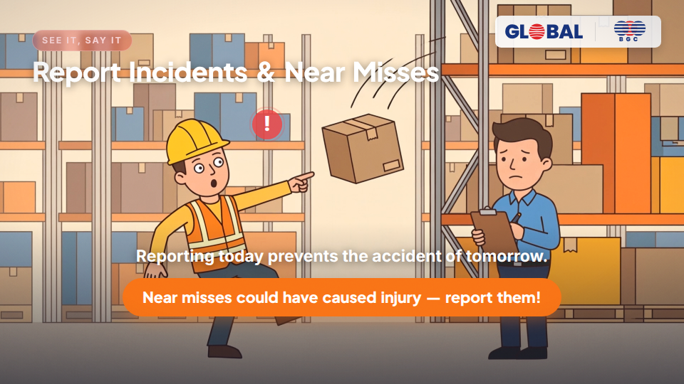 |
| 12 | Closing — Together, We Work Safely |  |
| 13 | End Credits | 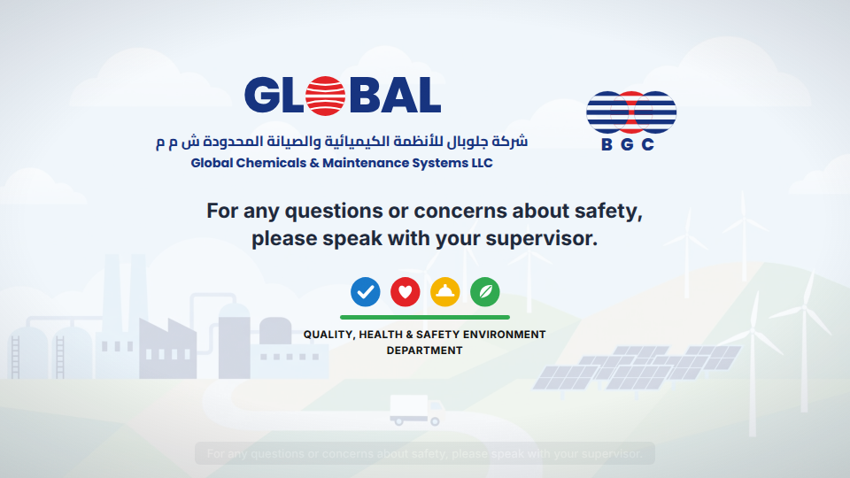 |
