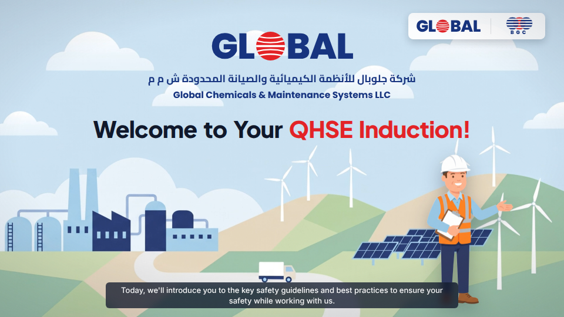
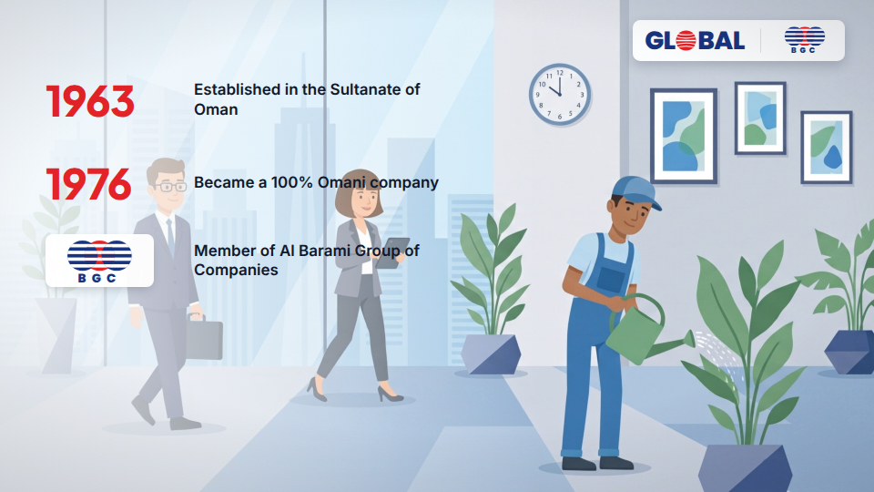
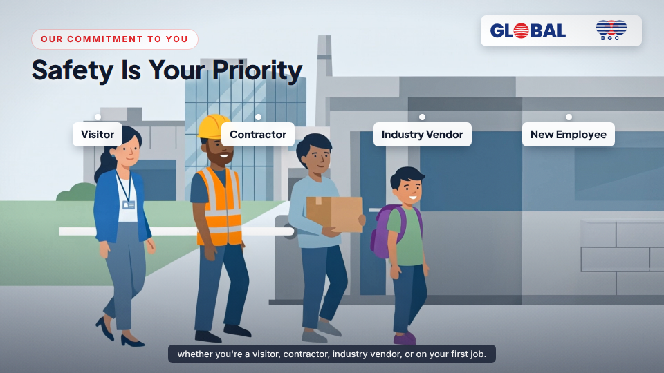
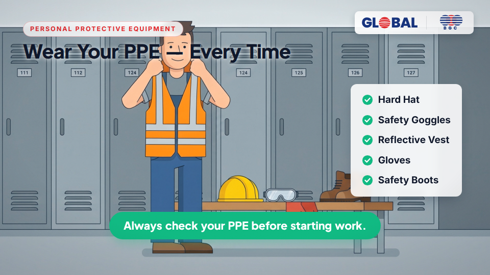
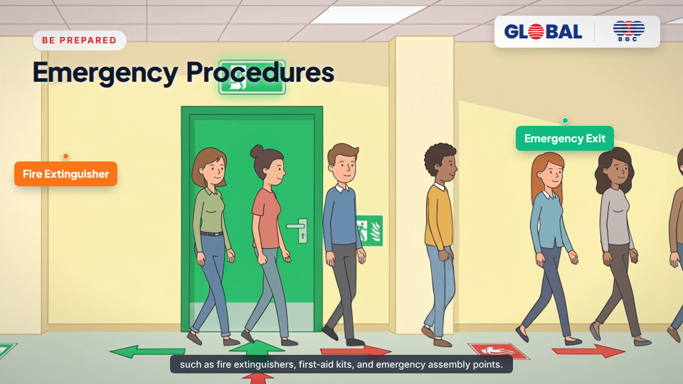
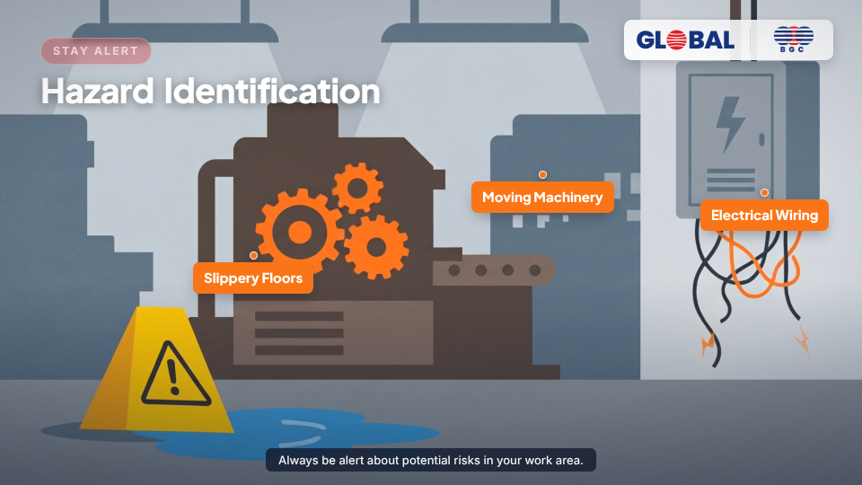
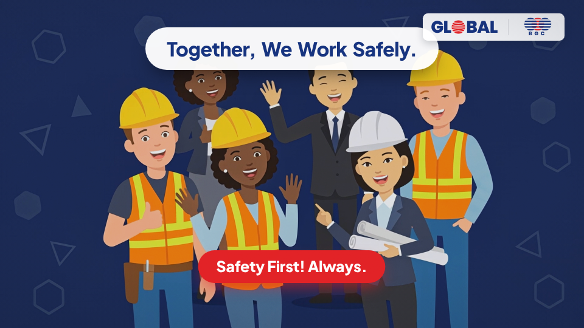

# HSE Induction — Scene Preview Gallery

One representative frame per scene, in script order. Full animated video: [`out/hse-induction.mp4`](../out/hse-induction.mp4).

| # | Scene (script beat) | Preview |
|---|---|---|
| 1 | Welcome — GCMS + QHSE Induction |  |
| 2 | About GCMS — **BGC logo on the "Al Barami Group of Companies" milestone** |  |
| 3 | Approvals & Certifications (DCRP · JSRS · OPAL · ISO · Tender Board) |  |
| 4 | Safety Is Your Priority — visitor / contractor / vendor / new employee |  |
| 5 | First Things First — visitor pass, host, no photos |  |
| 6 | Wear Your PPE — gearing up in the locker room |  |
| 7a | Emergency Procedures — corridor evacuation |  |
| 7b | Assembly Point — headcount |  |
| 8 | Hazard Identification |  |
| 9 | Safe Work Practices — correct vs incorrect lifting |  |
| 10 | The 12 Golden Life Saving Rules |  |
| 11 | Report Incidents & Near Misses |  |
| 12 | Closing — Together, We Work Safely |  |
| 13 | End Credits |  |
